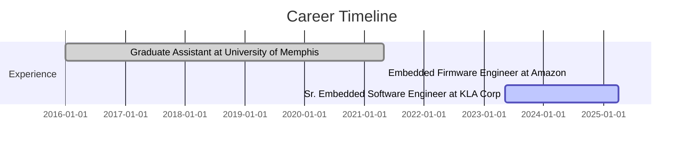

# Md Sabbir Bin Zaman - Embedded Software Engineer

## 📫 Contact Information
- **Email:** sabbir.zaman@hotmail.com
- **LinkedIn:** [linkedin.com/in/sabbirzaman](https://linkedin.com/in/sabbirzaman)
- **GitHub:** [github.com/zamansabbir](https://github.com/zamansabbir)
- **Phone:** (901) 552-2364
- **Location:** Milpitas, CA, USA

---

## 💼 Professional Summary
🌟 Dynamic and results-oriented software engineer with 5+ years of experience in embedded systems, real-time Linux, and high-performance software development. Proven track record of leading projects from concept to deployment, collaborating with cross-functional teams, and delivering robust and scalable solutions.

---

## 🛠️ Skills
- **Programming Languages:** C, C++, MIPS Assembly, Python, Bash
- **Operating Systems:** Linux (Real-Time), Embedded Linux, FreeRTOS
- **Tools & Frameworks:** GDB, Yocto, Docker, Git, Meson, Ninja, CMake, Jira, Jenkins
- **Technologies:** PCIe, FPGA, Z-Wave, TCP/IP, BLE
- **Soft Skills:** Problem Solving, Team Collaboration, Agile Methodologies

---

## 📝 Professional Experience
### **Sr. Embedded Software Engineer**  
KLA Corporation, Milpitas, CA  
May 2023 - Present
- Lead the architecture and end-to-end design of CDDSW, a real-time embedded software stack controlling high-performance column driver and datapath electronics in electron-beam systems.s.
- Architected and developed multi-threaded C++ applications on real-time Linux, focusing on deterministic behavior, low-latency performance, and system scalability.
- Designed a modular and extensible software framework, enabling seamless integration of new FPGA components and hardware configurations.
- Drove system-wide architectural decisions, balancing trade-offs between memory usage, timing guarantees, and maintainability in resource-constrained environments
- Spearheaded the development of PCIe kernel and user-space drivers, enabling high-throughput, low-latency communication with custom FPGA hardware.
- Collaborated closely with hardware, FPGA, and systems teams to align software architecture with evolving hardware capabilities and safety requirements.
- Promoted and enforced design patterns and development practices that ensured real-time safety, fault tolerance, and graceful degradation in emergency scenarios

### **Embedded Firmware Engineer**  
Amazon., Malvern, PA  
May 2021 - April 2021
- Expertly designed and developed high-performance, test-driven embedded software applications and systems for Z-Wave based home security products, utilizing cutting-edge technologies such as C, Arm Cortex M-4 and M-33 processors, and FreeRTOS
- Successfully solved complex bugs and glitches using advanced debugging tools such as gdb and ozone, ensuring that projects were delivered on time and with high quality.
- Conducted thorough code reviews and implemented effective maintenance strategies for a Git-based source code repository, ensuring the stability and reliability of all software products.
- Collaborated with cross-functional teams for successful delivery of high-quality firmware, including customer needs analysis, technical discussions, and a focus on quality from POC to production code

### **Graduate Assistant**  
University of Memphis., Memphis, TN  
Jan 2016 - April 2021
- Developed FreeRTOS-based firmware in C and applied DSP with noise cancellation using DReM for NSF-funded BLE smart health devices.
---

## 🌟 Projects
- **CDDSW: Real-Time Distributed Control System for Embedded Linux**
Designed and implemented a high-performance, multi-threaded application to manage real-time FPGA interactions via PCIe, coordinating command handling from the IAS subsystem and processing requests from the PRI subsystem within a distributed system architecture.
- **Coin Cell Battery Charging:** Contributed to the design and successful implementation of an advanced battery reporting algorithm for Ring coin-cell based sensors, resulting in improved user experience and receiving positive reviews on Amazon.
- **Sensor Toolbox:** Developed a robust I2C based temperature sensor driver with a factory pattern design that supports multiple sensor types, enables easy integration, a flexible and scalable solution for adding new temperature sensors without impacting the application layer.

---

## 🎓 Education
###  **PhD in Computer Engineering**
- **Dissertation:** A Hardware-Software Co-designed Wearable for Real-Time Physiological Data Collection and Signal Quality Assessment
University of Memphis, Memphis, TN  
2016 - 2021
###  **B.S. in Electrical & Electronic Engineering**
- **Thesis:** Design and development of inexpensive and user-friendly hand-
held frequency meter.
RUET, Rajshahi, BD  
2007 - 2011

---

## 📅 Visual Timeline

---

## 📂 References
Available upon request.

